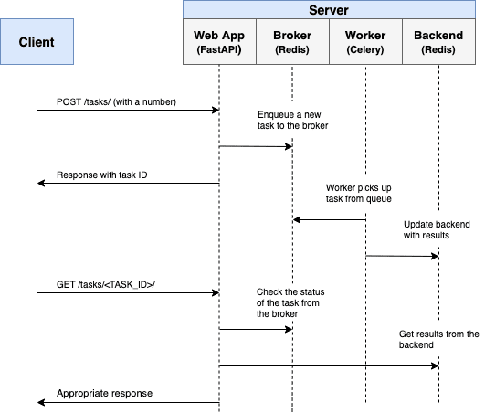

```bash
sudo  docker compose up -d --build
sudo docker compose up -d --build --scale worker=3
sudo docker compose exec web python -m pytest
sudo docker compose exec web python -m pytest -k "test_task and not test_home"
```


curl http://localhost:8004/tasks/0eb7ba45-e06a-44ba-9ea5-c549bfd06f70

[http://localhost:8004](http://localhost:8004)
[Flower][http://localhost:5556]

# Asynchronous Tasks with FastAPI and Celery

Example of how to handle background processes with FastAPI, Celery, and Docker.



[https://habr.com/ru/articles/733452/](https://habr.com/ru/articles/733452/)